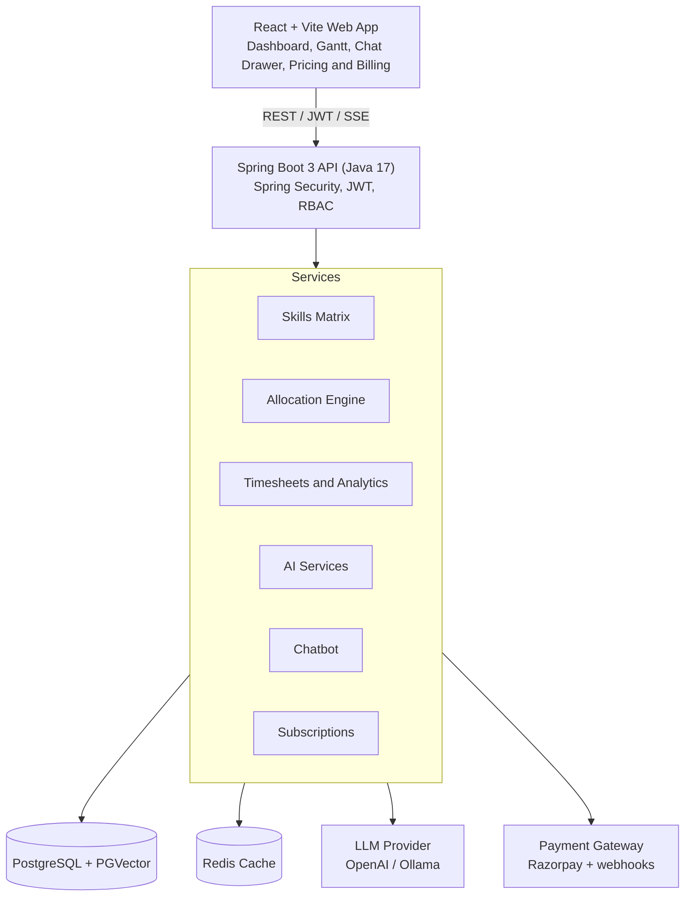
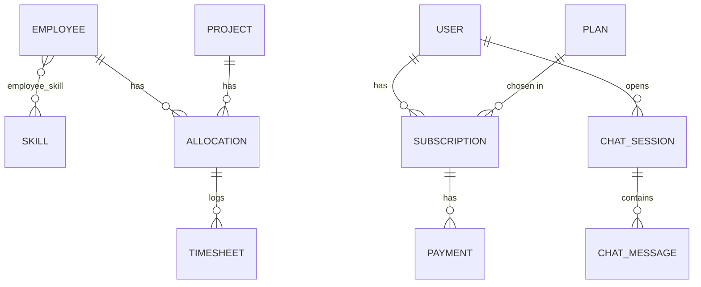
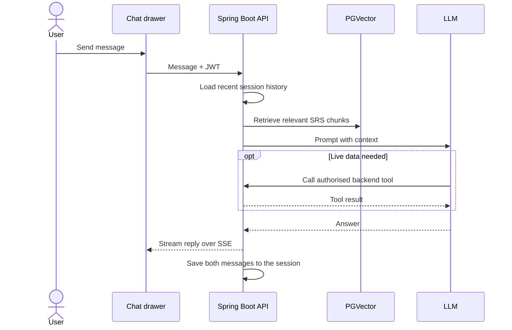
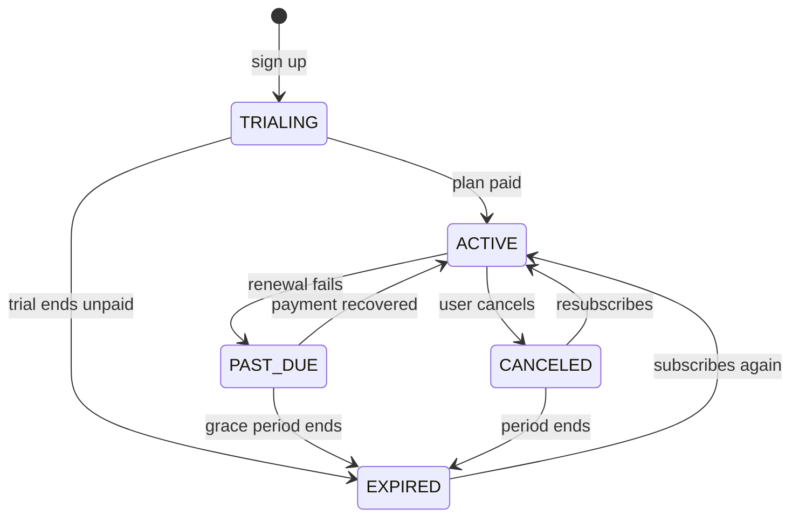

# MeritMatrix

**Intelligent Resource Allocation & PSA Platform**

AI-powered workforce matching, live budget tracking, a built-in chatbot and a 7-day free trial subscription.


---

## Table of contents

- [Overview](#overview)
- [Key features](#key-features)
- [Who uses MeritMatrix](#who-uses-meritmatrix)
- [Core modules](#core-modules)
- [Architecture and tech stack](#architecture-and-tech-stack)
- [Database design](#database-design)
- [Key workflows](#key-workflows)
- [Getting started](#getting-started)
- [Security and access control](#security-and-access-control)
- [Roadmap](#roadmap)

---

## Overview

MeritMatrix is an enterprise-grade Professional Services Automation (PSA) platform that optimizes workforce allocation, tracks real-time budget consumption and eliminates developer bench time.

It is delivered as a subscription web application: every new account starts with a **7-day free trial**, after which a paid plan is required.

By combining Retrieval-Augmented Generation (RAG) and semantic matching through Spring AI, the platform pairs developers with active project sprints based on granular technical competencies instead of rigid keyword searches.

| 7 days | 4 hours | 3 AI engines | Live |
|:---:|:---:|:---:|:---:|
| free trial before a paid plan | minimum timezone crossover | matching, blockers, chatbot | budget burn-rate tracking |

## Key features

- **Zero bench time:** automated bench detection with scheduled HR alerts.
- **No double-booking:** capacity rules are enforced on every allocation.
- **Live budget visibility:** real-time burn rate calculated from logged timesheets.
- **Semantic talent search:** natural-language matching using vector embeddings.
- **Early risk detection:** LLM analysis of timesheet notes to catch blockers.
- **Assistant and subscription:** an in-app chatbot and self-serve billing after the trial.

## Who uses MeritMatrix

| Role | What they do in the platform |
|---|---|
| **Project Manager** | Searches talent in natural language, allocates developers, monitors budget burn rate and sprint capacity. |
| **HR** | Receives bench alerts and reviews verified certifications and skills. |
| **Developer** | Logs timesheets, views assignments and asks the chatbot about project architecture. |
| **Account Owner** | Starts the free trial, chooses a plan and manages billing and payment history. |

## Core modules

### The Intelligent Skills Matrix

- **Semantic developer profiles:** employee metadata, historical project data and verified certifications.
- **API-verified credentials:** automated validation of third-party certifications (AWS Cloud Practitioner, Cisco Networking, Kaggle), forming a cryptographically verified "Merit Badge" system.
- **Bench tracking:** unassigned developers are calculated and flagged automatically, with cron-job alerts to HR to minimize non-billable hours.

### The Allocation Engine

- **Double-booking prevention:** custom JPQL queries sum an employee's assigned hours across overlapping dates. If the total exceeds weekly capacity, a `ResourceOverallocatedException` blocks the assignment.
- **Timezone and geographic assembly:** for distributed teams, geographic offsets are calculated to guarantee a minimum 4-hour active crossover window.

### Timesheets and Financial Analytics

- **Live budget burn rate:** logged hours multiplied by each employee's hourly cost are deducted from the project budget in real time.
- **Redis caching:** financial metrics and active sprint capacities are cached so dashboards render instantly without loading the primary database.

### AI and Automation (Spring AI)

- **Semantic resource matching:** PGVector stores skill embeddings. Project Managers search in natural language, for example: *"Need a developer who has built complex Data Flow Diagrams and real-time dashboards."*
- **Daily blocker detection:** structured-output LLM converters scan timesheet notes to flag sentiment issues or technical blockers (for example Docker networking) before they derail timelines.
- **Autonomous Q&A agent:** a RAG chatbot over Software Requirements Specifications (SRS), described below.

### AI Chatbot Assistant

A slide-out assistant available on every page of the dashboard, extending the RAG agent into a general project helper.

- **Project knowledge (RAG):** ingests SRS documents and project notes, answering architecture and onboarding questions from PGVector context.
- **Live platform queries:** the LLM calls backend tools (Spring AI tool calling) for questions like "Who is on the bench this week?" or "How much budget is left on Project X?".
- **Role-aware answers:** every tool call runs with the caller's JWT permissions, so restricted data stays restricted.
- **Streaming responses:** replies stream token by token to the React chat drawer over Server-Sent Events (SSE).
- **Conversation memory:** sessions and messages are persisted, and recent context is cached in Redis for coherent follow-ups.

### Subscription and Payment Gateway

The website is monetized through subscriptions. Plans and prices are configurable in the database, not hard-coded.

- **7-day free trial:** every new account starts a trial automatically with full access. No payment details are required up front.
- **Trial reminders:** a UI banner shows the days remaining, and a scheduled job emails the user as the trial nears its end.
- **Plan subscription:** after the trial, the user selects a plan and pays through the gateway's hosted checkout (Razorpay by default, behind a provider-agnostic `PaymentGateway` interface).
- **Webhook confirmation:** signed gateway webhooks activate the subscription, and duplicate deliveries are ignored (idempotent).
- **Access control:** subscription status is enforced on the API, and expired accounts are redirected to the billing page.
- **Self-service billing:** users can view their plan and payment history, renew or cancel at any time.

## Architecture and tech stack

MeritMatrix follows a decoupled client-server architecture. The React web app talks to a stateless Spring Boot API over REST, SSE and JWT. The API orchestrates PostgreSQL/PGVector, Redis, the LLM provider and the payment gateway.



| Tier | Technologies | Primary responsibility |
|---|---|---|
| **Frontend UI** | React, Tailwind CSS, Vite | Responsive glassmorphic analytics dashboard, Gantt charts, AI chatbot drawer, pricing page and billing screens. |
| **Backend core** | Java 17, Spring Boot 3.x | REST API orchestration, conflict-resolution logic, subscription rules and background cron jobs. |
| **AI intelligence** | Spring AI, OpenAI / Ollama | LLM orchestration, structured JSON output extraction and prompt engineering. |
| **Data persistence** | PostgreSQL, PGVector | Relational mapping (Employees to Projects) and high-dimensional vector storage for semantic search. |
| **Caching and auth** | Redis, Spring Security (JWT) | Stateless route protection, Role-Based Access Control (RBAC), high-speed caching and cached subscription status. |
| **Chatbot** | Spring AI `ChatClient`, tool calling, SSE | RAG over SRS documents, live data queries through backend tools and streamed responses. |
| **Payments** | Razorpay SDK, signed webhooks | Hosted checkout, payment verification and subscription activation after the free trial. |

## Database design

### Core domain

Employees are linked to projects through Allocations, and each Allocation collects many Timesheet entries. Skills are linked to employees many-to-many through an `employee_skill` join table.

| Entity | Fields |
|---|---|
| **Employee** | `id`, `name`, `role`, `hourly_cost`, `timezone`, `status` |
| **Skill** | `id`, `skill_name`, `vector_embedding` (PGVector), `is_verified` |
| **Project** | `id`, `project_title`, `total_budget`, `current_spend`, `deadline` |
| **Allocation** | `id`, `employee_id`, `project_id`, `allocated_hours`, `start_date`, `end_date` |
| **Timesheet** | `id`, `allocation_id`, `hours_logged`, `log_date`, `daily_notes`, `ai_risk_flag` |

### Subscription, accounts and chat

Each User has one subscription record per plan period, many payments over time and any number of chat sessions.

| Entity | Fields |
|---|---|
| **User** | `id`, `email`, `password_hash`, `role`, `created_at` |
| **Plan** | `id`, `plan_name`, `price`, `currency`, `billing_cycle`, `is_active` |
| **Subscription** | `id`, `user_id`, `plan_id`, `status`, `trial_start`, `trial_end`, `current_period_end`, `gateway_subscription_id`, `canceled_at` |
| **Payment** | `id`, `subscription_id`, `gateway_order_id`, `gateway_payment_id`, `amount`, `currency`, `status`, `paid_at` |
| **ChatSession** | `id`, `user_id`, `title`, `created_at` |
| **ChatMessage** | `id`, `session_id`, `role` (user / assistant), `content`, `created_at` |

`Subscription.status` values: `TRIALING`, `ACTIVE`, `PAST_DUE`, `EXPIRED`, `CANCELED`.



- **Vector storage:** skill embeddings are stored in a PGVector column, enabling similarity search for natural-language talent queries.
- **Pricing and payment data:** plan prices and billing cycles live in the `Plan` table, so pricing can change without a code deployment. Payment rows keep only gateway identifiers, never card data.

## Key workflows

### Double-booking prevention

Before an Allocation is saved, the service finds all of the employee's allocations whose dates overlap the request and sums their hours. If the total plus the new request exceeds the standard weekly capacity, the assignment is rejected with `ResourceOverallocatedException`.

### Budget burn rate

```text
project.current_spend = SUM( timesheet.hours_logged x employee.hourly_cost )
remaining_budget      = project.total_budget - project.current_spend
```

### Timezone crossover

For distributed teams, the engine compares candidates' working-hour windows using their stored timezones and accepts a team only if there are at least **4 hours** of overlap.

### AI workflows

- **Semantic search:** the query is embedded, then matched against stored skill embeddings in PGVector by vector similarity.
- **Blocker detection:** a scheduled job sends each day's `daily_notes` to the LLM, parses the structured response and sets `ai_risk_flag` on the Timesheet.
- **SRS Q&A:** SRS documents are chunked and embedded. Relevant chunks are retrieved and given to the LLM as context (RAG).

### Chatbot request flow



### Subscription lifecycle (7-day trial)

The trial starts at sign-up and needs no payment details. When it ends, access depends on whether the user has subscribed.



1. The user signs up. The backend creates a Subscription with status `TRIALING` and `trial_end = now + 7 days`.
2. A daily cron job emails reminders as the trial ends, and the UI banner shows the days left.
3. The user picks a plan. The backend creates a gateway order and a Payment record with status `Created`.
4. The gateway checkout opens in the browser and the user completes payment.
5. The gateway calls the webhook. The backend verifies the signature, marks the Payment `Captured` and the Subscription `ACTIVE` with a new `current_period_end`. Duplicate events are ignored.
6. If the trial ends unpaid, the Subscription becomes `EXPIRED`. A failed renewal moves it to `PAST_DUE`, and then to `EXPIRED` when the grace period ends.

**Access by subscription status**

| Status | Access | User experience |
|---|---|---|
| `TRIALING` | Full access for 7 days | Banner shows days left with an Upgrade button. |
| `ACTIVE` | Full access for the plan | Billing page shows plan and renewal date. |
| `PAST_DUE` | Full access during the grace period | Warning banner asks the user to fix payment. |
| `EXPIRED` | Locked, billing page only | Paywall prompts the user to choose a plan. |
| `CANCELED` | Full access until period end, then locked | Option to resubscribe at any time. |

## Getting started

### Prerequisites

- Java 17 and Maven (the project ships the `mvnw` wrapper)
- Node.js and npm
- PostgreSQL with the `pgvector` extension
- Redis server
- An OpenAI API key, or a local Ollama installation
- A payment gateway account (test-mode keys are enough for development)

### Backend setup (Spring Boot)

1. Make sure PostgreSQL is running locally on port `5432` with the `pgvector` extension enabled.
2. Start the Redis server on port `6379`.
3. Configure `application-dev.yml` with your database credentials, AI key and payment keys:

   ```yaml
   spring:
     datasource:
       url: jdbc:postgresql://localhost:5432/meritmatrix
       username: postgres
       password: yourpassword
     ai:
       openai:
         api-key: ${AI_API_KEY}

   app:
     subscription:
       trial-days: 7
     payment:
       provider: razorpay
       key-id: ${PAYMENT_KEY_ID}
       key-secret: ${PAYMENT_KEY_SECRET}
       webhook-secret: ${PAYMENT_WEBHOOK_SECRET}
   ```

   To receive webhooks on your local machine, expose the backend through a tunnelling tool and register that URL in the gateway dashboard.

4. Run the backend:

   ```bash
   ./mvnw spring-boot:run
   ```

### Frontend setup (React / Vite)

1. Navigate to the frontend directory.
2. Install packages, resolving legacy peer-dependency conflicts (Vite and Tailwind UI libraries):

   ```bash
   npm install --legacy-peer-deps
   ```

3. Start the Vite development server:

   ```bash
   npm run dev
   ```

4. Open the dashboard at the local URL printed by Vite (by default <http://localhost:5173>).

## Security and access control

- Stateless authentication with JWT tokens issued by Spring Security.
- Role-Based Access Control (RBAC) protects sensitive routes such as financial analytics and HR alerts.
- Secrets (AI key, payment keys, webhook secret) are injected through environment variables and never committed to source control.
- Payment webhooks are accepted only after their signature is verified with the webhook secret.
- Card and wallet details are handled entirely by the gateway checkout. MeritMatrix stores only gateway order and payment identifiers.
- Subscription status is checked on the server for every protected request (cached in Redis and refreshed on webhook events), so the UI cannot bypass the paywall.
- Only one free trial is allowed per account, which prevents repeated trial abuse.
- Chatbot tool calls inherit the caller's RBAC permissions, preventing data leakage through the assistant.

## Roadmap

- [ ] Additional payment providers, annual plans, coupons and refunds
- [ ] Expanded certification providers for the Merit Badge system
- [ ] Chatbot actions that can create allocations after user confirmation
- [ ] Forecasting of burn rate and bench risk from historical allocation data
- [ ] Additional dashboard views and report exports

---

*MeritMatrix, Project Documentation, Version 1.0, October 2026*
